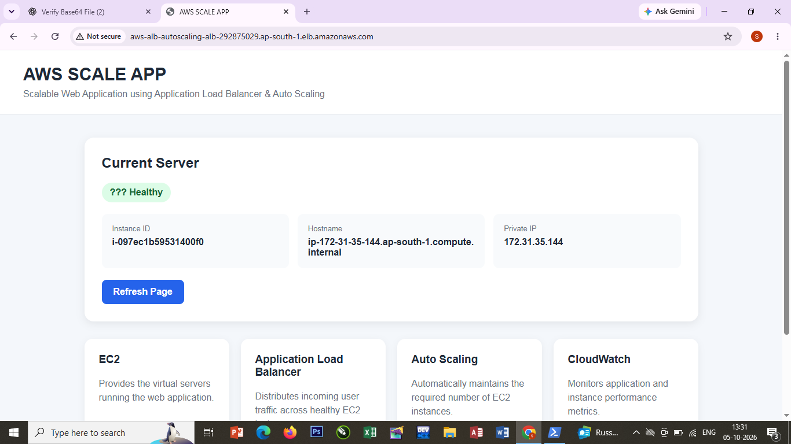
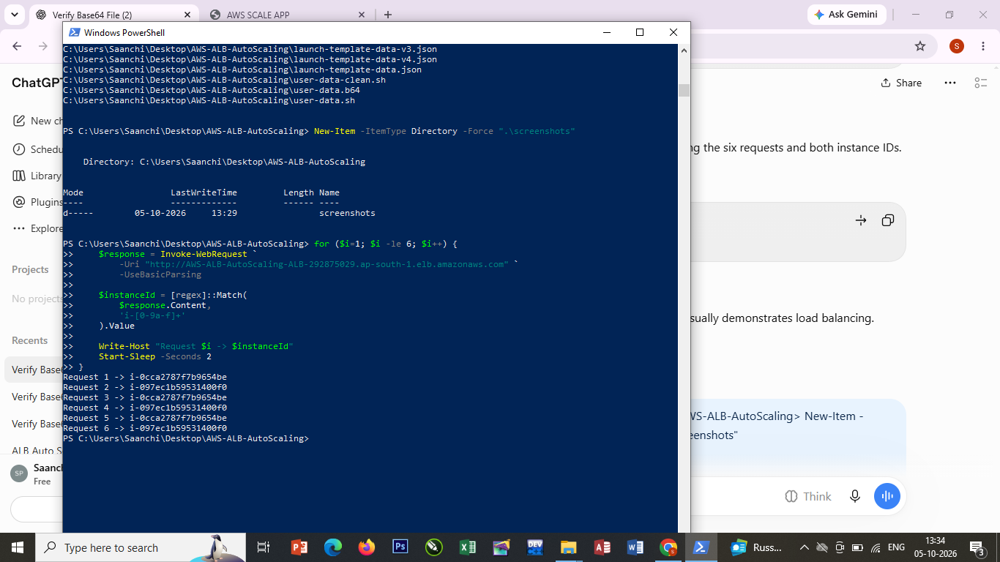
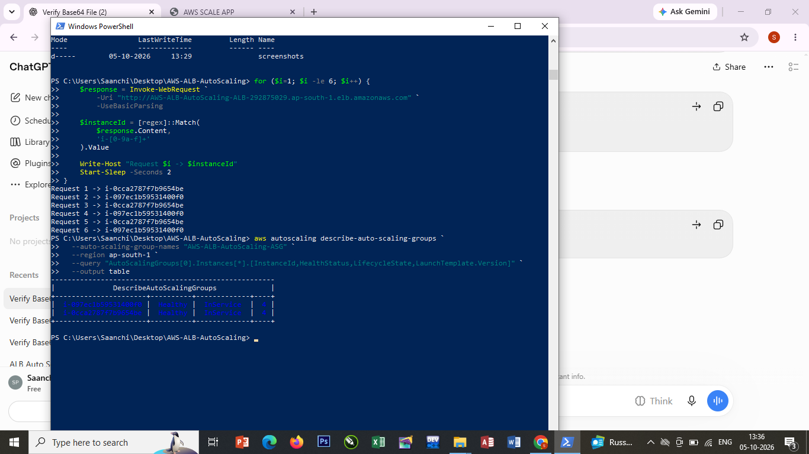
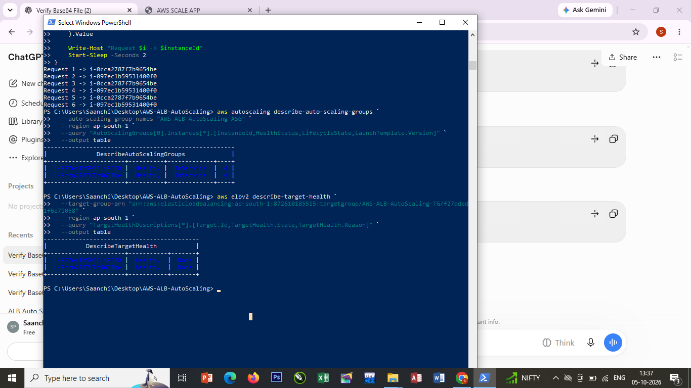
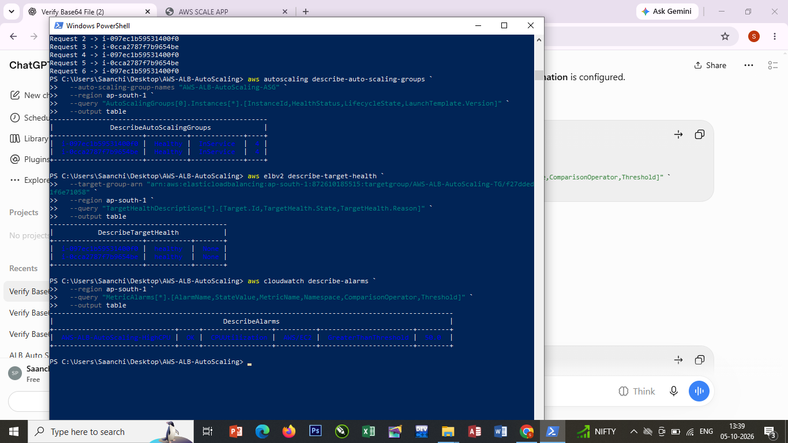

# AWS ALB Auto Scaling Project

## 🚀 Live Demo

[Open Live AWS Application](http://aws-alb-autoscaling-alb-292875029.ap-south-1.elb.amazonaws.com/)

## 📌 Project Overview

This project demonstrates a scalable and highly available web application using AWS Application Load Balancer, Amazon EC2, Auto Scaling Group, Target Group, CloudWatch, IAM, and Launch Template.

## 🏗️ AWS Services Used

- Amazon EC2
- Application Load Balancer (ALB)
- Target Group
- Auto Scaling Group
- Amazon CloudWatch
- AWS IAM
- EC2 Launch Template

## 🔄 Architecture

Internet User  
↓  
Application Load Balancer  
↓  
Target Group  
↓  
EC2 Instances  
↓  
Auto Scaling Group  
↓  
CloudWatch Monitoring

## ✨ Features

- Application Load Balancing
- EC2 instance management
- Auto Scaling
- Target Group health monitoring
- CloudWatch monitoring
- Task Management Dashboard
- Scalable web application

## 📸 Screenshots

### ALB Website

### ALB Traffic Distribution

### Auto Scaling Instances

### Target Group Health

### CloudWatch Alarm

## 💻 Technology Stack

- Python
- HTML
- CSS
- JavaScript
- Linux
- AWS CLI
- PowerShell
- Git & GitHub

## 👩‍💻 Developer

**Saanchi Narendra Padekar**

BCA Graduate | Aspiring Data Analyst & Business Analyst | AWS Cloud Fresher